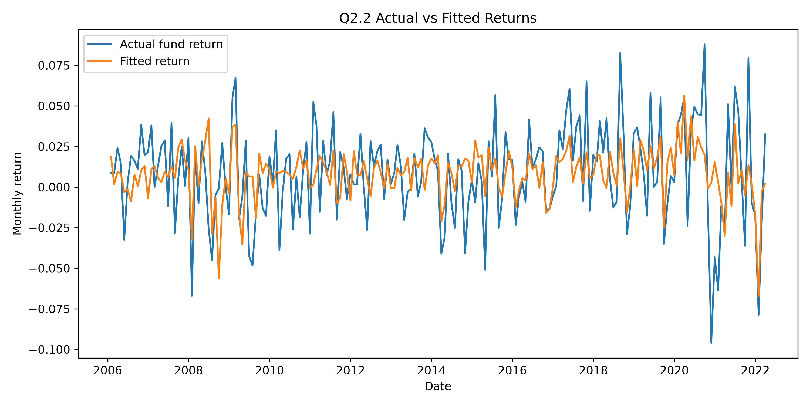
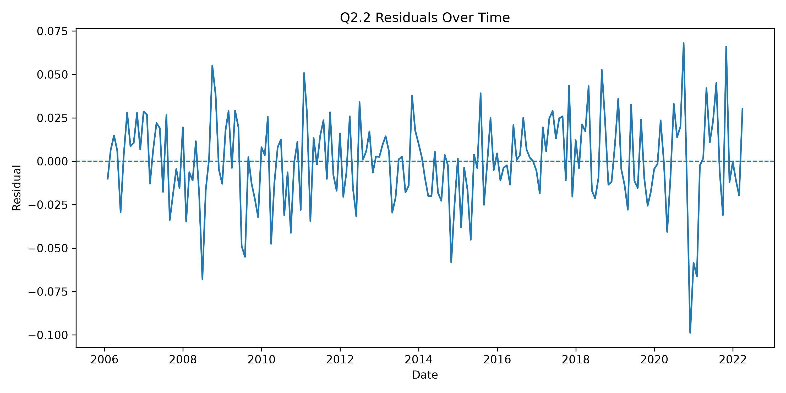
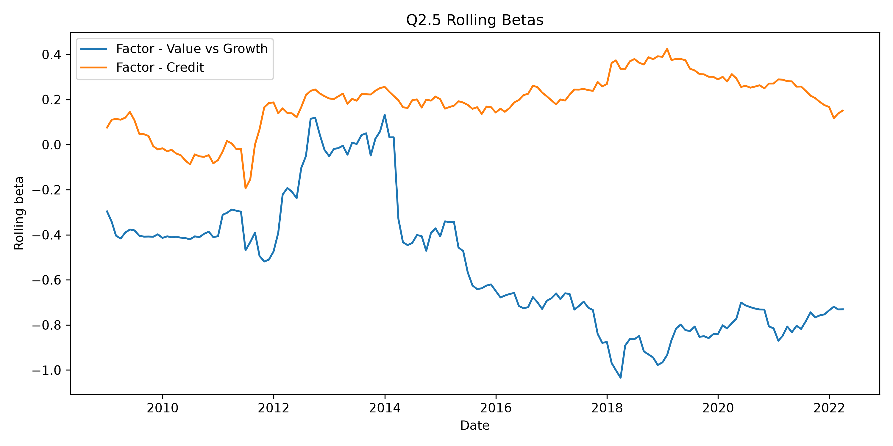

# Question Answers

## Question 1.1

I implemented this in `q1_1_GUI.py` using Tkinter for the GUI. The user can enter either a GitHub username or a full GitHub profile URL. 
The scraping is done using `requests` and `BeautifulSoup`. 

The output Excel file contains the repository name and repository URL. 

Basic error handling include: the program checks whether the username is empty, whether the save path is selected, whether the GitHub user exists, and whether public repositories are found.

## Question 1.2

Implemented the chatbot in a separate file, `q1_2_chatbot.py`, and imported it into the main GUI file. After repositories are scraped, the repository names are stored in a list. The user can then type a question into the chatbot box, and the program sends the question plus the repository names to Gemini.
 

## Question 2.1


I first loaded the `returns data` sheet from `data.xlsx`. The target variable is the hedge fund return column, and the explanatory variables are the factor return columns beginning with `Factor -`.

Before fitting the model, I sorted the data by date and removed missing observations in the model columns. I also checked for extreme factor values greater than 1 in absolute value. Six extreme factor values were found and corrected by dividing them by 1,000,000, as they appeared to be incorrectly scaled.

The full model had:

```text
R-squared: 0.3411
Adjusted R-squared: 0.2737
```

To make the final model more parsimonious and readable, I selected factors with p-values below 10% in the full model. The selected factors were:

```text
Factor - Value vs Growth
Factor - Credit
```

Then refitted the final regression model using only these selected factors.


```text
Monthly alpha: 0.008347
Annualised alpha: 10.02%

Beta to Factor - Value vs Growth: -0.589709
Beta to Factor - Credit: 0.154235

R-squared: 0.2816
Adjusted R-squared: 0.2741
AIC: -878.6080
BIC: -868.7890
```

The negative beta to Value vs Growth suggests the fund had negative exposure to this factor, the positive beta to Credit suggests positive exposure to the credit factor.

## Question 2.2


The final model had:

```text
R-squared: 0.2816
Adjusted R-squared: 0.2741
F-test p-value: 0.000000
RMSE: 0.025043
```

The F-test p-value is  small, which suggests that the regression model is statistically significant overall.

The coefficient results were:

```text
const: coefficient = 0.008347, p-value = 0.000007
Factor - Value vs Growth: coefficient = -0.589709, p-value = 0.000000
Factor - Credit: coefficient = 0.154235, p-value = 0.022012
```

Both selected factors are statistically significant in the final model. The intercept is also statistically significant.

Checked the residuals using Durbin-Watson and Jarque-Bera diagnostics:

```text
Durbin-Watson statistic: 1.6945
Jarque-Bera p-value: 0.002166
```

The Durbin-Watson statistic is reasonably close to 2, so there is no strong evidence of severe residual autocorrelation. The Jarque-Bera test suggests that the residuals are not normally distributed. This is common for financial return data, which often has fat tails.

The actual vs fitted plot shows that the fitted return series follows the broad movement of the hedge fund returns but is smoother than the actual fund return. This is expected because the regression model explains only part of the return variation.



The residual plot shows periods of larger unexplained returns, especially around stressed market periods. This suggests that the model is useful but not complete, and that the fund may also be exposed to risks not captured by the selected factors.



## Question 2.3


Constructed a beta-replicating factor portfolio using the final regression betas as factor weights:

```text
Factor - Value vs Growth: -0.589709
Factor - Credit: 0.154235
```

Compared the hedge fund return with the factor portfolio return.

```text
Hedge Fund annualised return: 10.11%
Factor Portfolio annualised return: 0.09%

Hedge Fund Sharpe ratio: 0.985318
Factor Portfolio Sharpe ratio: 0.017434

Hedge Fund cumulative return: 372.05%
Factor Portfolio cumulative return: -0.85%
```

Based on these results, the hedge fund was clearly more profitable than the beta-replicating factor portfolio and had a much higher Sharpe ratio.


## Question 2.4


I compared the two strategies using annualised volatility, maximum drawdown, monthly 5% Value at Risk, and monthly 5% Expected Shortfall.


```text
Hedge Fund annualised volatility: 10.26%
Factor Portfolio annualised volatility: 5.45%

Hedge Fund maximum drawdown: -23.38%
Factor Portfolio maximum drawdown: -18.04%

Hedge Fund monthly VaR 5%: 4.08%
Factor Portfolio monthly VaR 5%: 2.46%

Hedge Fund monthly Expected Shortfall 5%: 5.76%
Factor Portfolio monthly Expected Shortfall 5%: 4.15%
```

The hedge fund had higher volatility, larger maximum drawdown, higher VaR, and higher Expected Shortfall. Therefore, the hedge fund was more risky. But it also has much higher annualised return and a much higher Sharpe ratio.

## Question 2.5


I calculated rolling betas using a 36-month rolling regression window. For each rolling window, I refitted the regression model using the selected factors and stored the rolling beta estimates.



Then tested each rolling beta series using both the ADF test and KPSS test.

```text
Factor - Value vs Growth:
ADF p-value = 0.583436
KPSS p-value = 0.010000
Conclusion = Likely non-stationary

Factor - Credit:
ADF p-value = 0.361288
KPSS p-value = 0.010000
Conclusion = Likely non-stationary
```

The ADF test does not reject the null hypothesis of non-stationarity, while the KPSS test rejects the null hypothesis of stationarity. Both tests suggest that the rolling beta series are likely non-stationary.

The rolling beta plot also supports this conclusion. The Value vs Growth beta changes substantially over time, and the Credit beta also moves across different regimes.

It indicates a static beta model may not capture the fund's current factor exposures. If the fund's exposures change over time, then historical average betas may give a misleading view of current risk. This suggests that rolling beta monitoring or time-varying exposure analysis would be useful when assessing this fund.

## Overall Conclusion

The selected regression model suggests that the hedge fund has significant exposure to Value vs Growth and Credit factors, it also has a positive and statistically significant alpha.

Compared with a beta-replicating factor portfolio, the hedge fund produced much higher historical returns and a much higher Sharpe ratio. However, it also had higher absolute risk, including higher volatility, larger drawdown, higher VaR, and higher Expected Shortfall.

The rolling beta and stationarity tests suggest that the fund's factor exposures are not stable over time. This means the fund should not be assessed only using a static beta model. So rolling exposure monitoring is important from a risk perspective.
